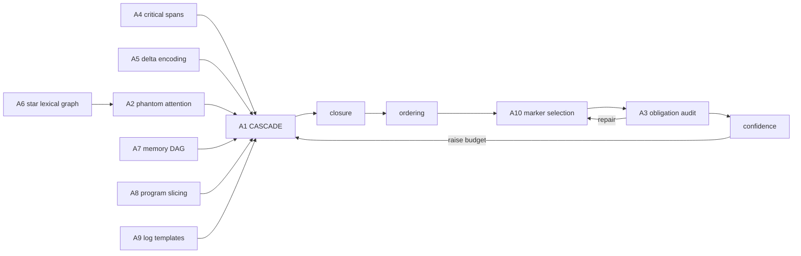

# Algorithms

Ten algorithms that do not exist in the prompt-compression literature in this
form. Each is stated as pseudocode with its complexity, its measured effect, and
its failure mode.

---

## A1 — CASCADE
*Constraint-Aware Submodular Cascaded Allocation with Dependency Enforcement*

The optimiser. Multiple-choice knapsack over fidelity ladders with a submodular
objective, solved by lazy greedy + singleton correction, after a water-filling
budget split.

```
CASCADE(U, B, cfg):
  # 1. protection floor
  for u in U: ℓ(u) ← μ(π(u))                       # min admissible rung
  base ← Σ c(u, ℓ(u))
  if base ≥ B: return                              # protection outranks budget
  cov ← Coverage(w);  for u: cov.add(C(u, ℓ(u)))

  # 2. water-filling across documents
  groups ← partition U by doc_id
  v_i ← Σ_{u∈g_i} salience(u) · retriever_score(g_i)
  cap_i ← Σ_{u∈g_i} c(u, m_u) − c(u, ℓ(u))
  b ← WATERFILL(v, floors=0, caps=cap, B − base)

  # 3. lazy greedy per group
  for (g_i, b_i) in zip(groups, b):
      spent += GREEDY(g_i, cov, b_i, θ=cfg.marginal_floor)

  # 4. spillover: unused budget goes to a global round
  if (B − base − spent) > 8: GREEDY(all_upgradable, cov, leftover, θ)

GREEDY(units, cov, B, θ):
  H ← max-heap keyed by ΔF/Δc for the next rung of each unit
  best_ratio ← 0;  singleton ← ⊥
  while H and spent < B:
      (r̂, u, ℓ_seen) ← pop(H)
      if ℓ(u) ≠ ℓ_seen: continue                   # stale: unit moved
      (r, Δc) ← candidate(u)                       # recompute now
      if Δc > B − spent:                           # unaffordable
          if r·Δc > gain(singleton): singleton ← (u, ℓ(u)+1)
          continue
      if r < r̂·0.999: push(H, r, u, ℓ(u)); continue    # CELF requeue
      best_ratio ← max(best_ratio, r)
      if θ > 0 and r < θ·best_ratio: break         # marginal-utility stop
      apply upgrade; spent += Δc; push next rung of u
  if gain(singleton) > achieved(units):            # greedy vs best single element
      reset units to floor; apply singleton
```

- **Complexity** `O(M log M)`, `M = Σ_u |L(u)|`. Measured 18 ms on 10 066 units.
- **Guarantee** `(1−1/e)/2` (Khuller–Moss–Naor). Measured gap to a
  *conservative* LP bound: **35.4% mean / 32.4% median** (`bench/lp_bound.py`);
  the bound over-estimates, so the true gap is smaller.
- **Failure** Greedy is not optimal; pathological ladders with non-convex
  cost/value can mislead the ratio. Mitigated by monotone-cost sorting of rungs.

---

## A2 — Phantom Attention

Model-free simulation of where an LLM will look.

```
PHANTOM_ATTENTION(U, edges, query):
  G ← empty sparse graph
  G ← G ∪ typed edges (REQUIRES 1.35, REFERS 1.00, CONTAINS 0.75, ANSWERS 0.90,
                       DUPLICATE 0.15, SUPERSEDES 0.10)
  G ← G ∪ lexical star edges     # A6
  for each document, for d in 1..3:
      G ← G ∪ ADJACENT(u_i, u_{i+d}) · e^{−d/3}      # positional decay
  p ← personalisation:
        +2·query_weight  if u ∈ {system, tools, instruction, query}
        +query_weight·3·Σ_{t∈q} c_t(u)                # query term mass
        +0.25·(e^{−4·rel} + e^{−4(1−rel)})            # U-shaped position prior
        +recency_weight·rel·recency(u)
  r ← PAGERANK(G, p, α=0.85, iters=18)
  att(u) ← (r_u / max r) / √(tok(u)/24)               # density, not mass
```

- **Complexity** `O(nnz · iters)`, `nnz ≈ 12n`. 66 ms on 10 066 units.
- **Gain** Query-aware ranking with **zero GPU** and, unlike perplexity,
  **reproducible**. But measured contribution on this benchmark is ~0.1 points of
  ratio and zero answerability — see docs/BENCHMARKS.md §6. It is the one
  algorithm here that has not earned its place on evidence.
- **Failure** Degenerates toward degree centrality with no query and no
  structure; density normalisation contains the damage.

---

## A3 — Obligation Surjection with Minimal-Carrier Repair

Preservation as a decidable proof obligation.

```
AUDIT(out, obligations, retained_keys):
  present ← keys(E(out))                    # SAME extractor as on the source
  for o in obligations:
      hit ← o.key ∈ present
             ∨ (o is a phrase ∧ canon(o.literal) ⊂ canon(out))
             ∨ canon(o.literal) ⊂ canon(out)
      classify into  integrity / critical / retention  buckets

REPAIR(missing, budget_cap):                # cheapest strategy first
  group missing by owning unit
  for (u, obs) in groups sorted by |obs| desc:
      if spent ≥ cap: break
      if ∃ rung k ≥ ℓ(u) with obs ⊆ O(u,k):
          ℓ(u) ← k;  spent += c(u,k) − c(u,ℓ(u))     # (1) promote in place
      else:
          text ← merge of enclosing sentences of each obligation   # (2) merge
          if u is code and text is not prose-shaped: skip          # never fake
          emit synthetic FACT unit;  spent += tok(text)            # (3) bounded
```

- **Complexity** `O(|out| + |obligations|)` per round, ≤ 4 rounds.
- **Termination** repairs are monotone additions to a finite set; cap
  `max(48, 0.35·B)`.
- **Why it matters** The audit uses the *same function* on input and output, so
  there is no distribution shift between "what we protected" and "what we
  check". Earlier versions used an unbounded repair loop and inflated a prompt
  by 3 200 tokens — now a regression test.

---

## A4 — Critical Span Protection

Makes intra-unit editing safe.

```
TIGHTEN(u):
  P ← protected_spans(u)          # every obligation's char range
  cuts ← ∅
  propose(a,b):
      if ∃(s,e)∈P with [a,b)∩[s,e) ≠ ∅:  refuse
      if text[a:b] matches [\d`$%°€£¥] | [=<>+*/^~|] | \b(not|no|never|must|only|max|min)\b: refuse
      cuts ← cuts ∪ {[a,b)}
  propose each: assistant boilerplate opener, hedge phrase,
                parenthetical < 60 chars, trailing example clause, filler adverb
  return text with cuts removed, whitespace normalised
```

The second refusal rule exists because the obligation extractor cannot prove
everything: `(1 − 1/e)` in a bound has no obligation, but deleting it destroyed
a theorem statement in testing. Digits and operators are load-bearing far more
often than they are decorative.

- **Gain** 1.2% mean extra reduction of the input (4.9% max) at zero obligation
  loss.

---

## A5 — Semantic Delta Encoding

```
DEDUP(U):
  sigs ← SIMHASH(u) for u ∈ U                        # numeric-slotted normal form
  buckets ← band(sigs, 10 bits) — union of 6 bands
  for bucket in buckets:                             # representative comparison
      reps ← []
      for m in bucket:
          if ∃ r ∈ reps with hamming(sig_m, sig_r) ≤ 24
                          ∧ MINHASH(m).jaccard(MINHASH(r)) ≥ 0.82:
              union(m, r)
          elif |reps| < 12: reps.append(m)
  for each cluster: canon ← argmax (|obligations|, tokens)
      for u ≠ canon:
          if normal_form(u) = normal_form(canon):
              Δ ← differing numeric slots
              emit rung  "= <canon> except {30s→5s}"   if it is ≥30% cheaper
          elif O(u) ⊆ O(canon):
              ℓ_max(u) ← 0 ;  add REQUIRES(u → canon)   # collapse entirely
```

MinHash sketches are built **lazily** — it is the confirmer, not the candidate
generator, so most units never need one.

- **Complexity** `O(n · reps)` expected. Replacing all-pairs-in-bucket with
  representative comparison took a 64k-token document from 5.0 s to 0.28 s in
  this stage.
- **Why delta and not deletion** Deleting the duplicate loses the fact that a
  *differing* instance existed — precisely the information a QA system needs.

---

## A6 — Star-Sparsified Lexical Graph

```
LEXICAL_EDGES(concepts, k=12, hubs=8):
  index ← inverted index over each unit's top-16 discriminative terms
  for (term, postings) in index:
      if |postings| < 2 or > 2000: skip            # ubiquitous ⇒ no signal
      H ← top-`hubs` postings by weight
      for (i, w_i) in postings, (j, w_j) in H, i≠j:
          acc[i][j] += w_i·w_j ;  acc[j][i] += w_i·w_j
  return top-k neighbours per node with similarity ≥ 0.05
```

The clique form is `O(df²)` per term and was the pipeline's dominant cost. The
star is `O(df·hubs)` and preserves component structure — the property PageRank
mass flow actually depends on.

---

## A7 — Conversation Memory DAG with Belief Revision

```
MEMORY(turns):
  records ← [(type, subject_key, terms) for each sentence of each turn]
     type ∈ {FACT, PREFERENCE, DECISION, TASK, CONSTRAINT, CORRECTION, Q, A, chat}
  # (a) same-subject supersession
  for r in records: if last[r.key] exists ∧ overlap ≥ 0.5: retract(last[r.key])
  # (b) explicit corrections — whole-log search with a recency prior
  for r where type = CORRECTION:
      target ← argmax_{c before r} overlap(c, r) · (0.6 + 0.4·e^{−Δturn/40})
      if score ≥ 0.45: retract(target)
  # (c) a retracted premise retracts its answer
  for turn t fully retracted:
      if turn t+1 is an assistant reply: retract(t+1)
  # (d) retracted turns are FORBIDDEN, not penalised
  for retracted u outside the recency window: L(u) ← {drop}
```

The fixed 12-turn correction window in the first version missed **every**
correction in 40-turn dialogues (they arrive ~20 turns later). A recency prior
over the whole log fixed it.

Step (d) matters more than it looks: as a penalty, retracted content still gets
selected whenever budget allows, and the context then contains both "$9,900/mo"
and "$1,200/mo" with no way for the model to tell which is current.

- **Measured** contradiction rate **0%** for ULRC³ vs **11–100%** for every
  baseline on the memory suite.

---

## A8 — Program Slicing with Signature Elision

```
CODE(src, lang):
  mod ← ast.parse(src)                    # or brace-scanner for other languages
  for each definition d:
      header_span(d) ← [start(d), last ':' before body[0]]     # VERBATIM slice
      ladder(d) ← [drop, header+"...", header+docline+"...", full]
      Merkle-hash the α-renamed body                            # duplicates
  edges:
      d → e            for each symbol e that d references
      d → import(i)    for each import binding a name d references   # pruning
      method → class header                                          # containment
  duplicates by Merkle hash → cap at signature rung + "# == canonical"
```

Reconstructing signatures with `ast.unparse` is semantically exact but not
byte-identical (`str='USD'` vs `str = "USD"`). Since we promise signatures
verbatim, we slice the source. Emitted Python is re-parsed; a failure is a
detected bug.

- **Measured** at 60.5% compression on the code suite: **100%** answerability,
  **100%** of signatures
  byte-identical, module parses, every needed import retained.

---

## A9 — Log Template Mining with Anomaly Flooring

```
MINE(lines):
  for line: (ts, level, body) ← parse
            mask ← body with UUID|IP|HEX|NUMBER|STRING slotted
            bucket ← (|tokens(mask)|, first token, level)
            match against bucket members with token similarity ≥ 0.72
  group := (mask, level, count, first_ts, last_ts, slot value sets, exemplar)
  ladder := [drop, "template ×N @window",
             + slot values + verbatim exemplar,
             all lines]
  floor(group) ← rung 1 if severity ≥ ERROR or count = 1     # anomalies
```

- **Complexity** `O(lines)` — fixed-depth bucketing, no sorting, no all-pairs.
- **Measured** 98.7% compression on the log suite with **100%** answerability,
  against **0%** for every baseline.

---

## A10 — Tokenizer-Measured Marker Selection

```
CHOOSE_MARKERS(tokenizer):
  for each candidate set S ∈ {ascii-hash, section, bracket, minimal}:
      cost(S) ← Σ tokenizer.count(marker) for marker ∈ S
  return argmin cost                      # memoised per tokenizer
```

Measured on `cl100k_base`: `⟦` = 2 tokens, `[[` = 1, `§` = 1, `#` = 1. On a
document with 40 sections, pretty Unicode brackets cost ~80 wasted tokens *per
request, forever*. The chosen set is declared in the output header so decoding
is unambiguous.

The same "measure, don't assume" rule governs entity interning: intern iff

```
count·(tok(name) − tok(alias))  >  tok(alias) + tok(name) + 2
```

Code identifiers, JSON keys and URLs are never interned — the model may have to
emit them back.

---

## Algorithm map


