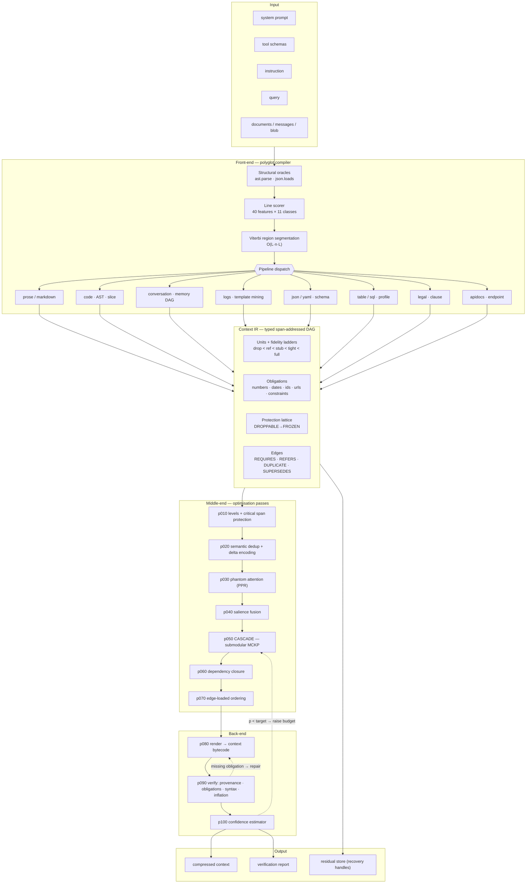

# ULRC³ Architecture

**Ultra Low-Resource LLM Context Compression Engine** — a semantic compiler for
LLM context.

---

## 0. The thesis

Every existing prompt compressor asks: *which tokens can I delete?*

That question has a fatal property — it has no notion of **correctness**. A
token-level compressor cannot tell you whether the compressed prompt still
contains the invoice number, still parses as Python, or still says "must not"
rather than "must". It optimises a proxy (perplexity under a small LM) and hopes
the proxy correlates with the thing you care about.

ULRC³ asks a different question:

> A prompt is *source code*. What is its intermediate representation, and what
> is the smallest program in that IR that preserves the observable behaviour we
> have committed to preserving?

That reframing buys four things no perplexity-based method can have:

| property | why it follows from the IR |
|---|---|
| **Provable preservation** | Retention is a constraint on the IR, checked by an audit that runs the *same extractor* on input and output. |
| **Zero hallucination** | Every rendering is composed of source spans + a closed marker vocabulary. Verified, not assumed. |
| **Recoverability** | Dropped spans keep stable handles; an agent can fault them back in. |
| **Structure-awareness** | Code compresses as an API surface, JSON as a schema, logs as templates — because the front-end actually parses them. |

And it runs on a CPU. No proxy LM, no GPU, no model download.

---

## 1. System diagram



---

## 2. The Context IR

The IR is a **typed, span-addressed DAG**. Three properties define it:

### 2.1 Addressable, never destructive

Compression never deletes source. It *selects a rendering policy per node*.
Every `Unit` holds a `Span` into the original document, so:

- provenance is a lookup, not an inference;
- dropped units keep handles and can be re-expanded;
- the audit can always locate the minimal carrier of a missing fact.

### 2.2 The fidelity ladder

Each unit exposes an ordered list of renderings:

```
level 0  drop      ""                                              0 tok
level 1  sig       def charge(self, cid: str, cents: int) -> R:   11 tok
level 2  stub      + first docstring line                         18 tok
level 3  full      entire body                                   184 tok
```

Selection is therefore **multiple-choice**, not binary. This is the single
biggest structural difference from LLMLingua-family methods: at a tight budget
they must choose between the whole function and nothing, while ULRC³ buys the
11-token contract.

Ladders per content type:

| content | rungs |
|---|---|
| prose | drop · carrier (obligation clauses) · tight (filler-stripped) · full |
| code def | drop · signature · signature+doc · full body |
| class | drop · header · header+doc — methods are separate units, recomposed |
| log group | drop · `template ×N @window` · + slot values + exemplar · verbatim |
| JSON node | drop · induced schema · schema + k samples + stats · full |
| table | drop · header+profile · sampled rows · all rows |
| chat turn | drop · memory record · filler-stripped turn · verbatim |

**Every rung is extractive.** Nothing is generated. That is what makes the
zero-hallucination check decidable.

### 2.3 The protection lattice

```
DROPPABLE < ELASTIC < ANCHORED < LOCKED < FROZEN
```

- `FROZEN` — byte-identical, never reordered (system, tools, instruction, query)
- `LOCKED` — must survive carrying all of its obligations
- `ANCHORED` — must survive in some form (≥ rung 1)
- `ELASTIC` — negotiable
- `DROPPABLE` — boilerplate, small talk, retracted statements

Protection propagates along `REQUIRES` edges with decay (`demote`), as a
monotone dataflow fixpoint. Finite lattice + monotone transfer ⇒ termination in
`O(V + E·|lattice|)`.

---

## 3. Stage-by-stage

For each stage: **purpose · algorithm · complexity · expected gain · failure
mode**.

### Stage 0 — Structural oracles

**Purpose.** Do not guess what a real parser can decide.
**Algorithm.** `json.loads` on the whole document; `ast.parse` when a cheap
pre-filter sees ≥2 `def|class|import` lines.
**Complexity.** O(n), amortised near-zero because the pre-filter rejects almost
everything.
**Gain.** Eliminates the worst class of error: a Python file with a long module
docstring reads as prose to *every* line-level heuristic. Before this check,
such files were region-split and emitted unparseable code.
**Failure.** A syntactically-valid Python file that is *really* prose (rare;
harmless — the code pipeline degrades to prose when it finds no symbols).

### Stage 1 — Type detection & region segmentation

**Purpose.** Real prompts are polyglot. One pipeline per document is the biggest
quality loss in existing systems.
**Algorithm.** 40 orthographic/lexical features per line scored against 11
classes; first-order HMM with a switch penalty, decoded by Viterbi.
**Complexity.** O(|lines| · L²), L = 11 → microseconds per KB.
**Gain.** Correct pipeline per region. Measured: sending an API-reference table
through the code pipeline produced a single opaque 150-token unit with no
fidelity ladder and 5% compression; correct dispatch gives 48%.
**Failure.** Ambiguous regions (a prose paragraph inside a code comment). The
switch penalty biases toward stability; type entropy is recorded and feeds the
confidence estimator.

**Should this stage exist?** Yes, and it should be *per-region*, which is the
non-obvious part. A whole-document classifier is strictly worse.

### Stage 2 — Pipeline front-ends

Each builds units + structural edges. See §5.

### Stage 3 (p010) — Fidelity ladders & critical span protection

**Purpose.** Give the optimiser something to choose *between*, and make
intra-unit editing safe.
**Algorithm.** For units without a pipeline-supplied ladder: build a *carrier*
rung (sentences containing protected spans) and a *tight* rung (extractive
deletion of hedges, filler adverbs, short parentheticals, trailing examples).
Deletions are refused if they intersect a protected span **or** contain a digit,
operator, code span or scope word.
**Complexity.** O(n) with precompiled patterns.
**Gain.** 1.2% mean additional reduction of the input (4.9% max) at zero
obligation loss — smaller than it looks because most units are already at a
coarser rung; it also makes
LOCKED content affordable (a locked 267-token paragraph costs 30 tokens at the
carrier rung while carrying every obligation).
**Failure.** Over-aggressive hedge deletion changing epistemic status ("it is
possible that X" → "X"). Mitigated: `HEDGE` covers meta-commentary only, never
epistemic modals, and modals are CONSTRAINT obligations.

### Stage 4 (p020) — Semantic dedup + delta encoding

**Purpose.** Redundancy in real contexts is rarely literal.
**Algorithm.** Two-stage LSH: SimHash banding (candidates) → MinHash Jaccard
(confirmation), union-find clustering against bucket *representatives*.
Duplicates become `= <U4> except {30s → 5s}` when a delta is compact, or
collapse entirely when their obligations ⊆ the canonical's.
**Complexity.** O(n) expected. Representative comparison instead of all-pairs
took a 64k-token document from 5.0s to 0.28s in this stage.
**Gain.** 15–60% on RAG bundles and repo contexts.
**Failure.** Aggressive numeric slotting can merge statements that differ only
in a number — which is exactly why the *delta* is emitted rather than dropping
the duplicate.

**Should it exist?** Yes — but as *delta encoding*, not deletion. Deleting the
second instance loses the information that a differing instance existed.

### Stage 5 (p030) — Phantom Attention

**Purpose.** Score importance the way the downstream model will attend, without
running a model.
**Algorithm.** Build a multigraph (IDF-weighted lexical overlap ≈ induction
heads; exponential positional decay ≈ locality; CONTAINS/REQUIRES ≈ syntactic
heads), personalise on query/instruction units, solve `r = (1-α)p + αWᵀr` by
power iteration.
**Complexity.** O(nnz · iters), nnz ≈ 12n. ~70 ms on 5k units.
**Gain.** Query-aware ranking with no GPU and no proxy-model dependence — and it
is *reproducible*, unlike perplexity, which changes when the proxy LM changes.
**Failure.** With no query and no structure it degenerates toward degree
centrality, favouring long units — countered by normalising attention by
`√tokens` so the score measures *density*.

### Stage 6 (p040) — Salience fusion

Six signals: phantom attention, query relevance (contrastive), information
density (Stage 7 math), protection prior, kind prior, feature bonuses; minus
redundancy and filler ratio. Min-max normalised.

### Stage 7 (p050) — CASCADE

The optimiser. Multiple-choice knapsack with a monotone submodular objective,
solved by lazy greedy on benefit/cost ratio with the best-single-element
correction, after a water-filling split of the budget across documents. See
[MATH.md](MATH.md) §2–4.

**Failure.** Greedy is not optimal; measured mean gap of 35.4% to a
*conservative* LP upper bound (`bench/lp_bound.py`), which over-estimates on both
the fractional relaxation and empty-set gains. The known pathology (a single item
costing more than the whole budget) is handled by the singleton rule — without
it, a 28-token sentence carrying the document's only URL lost to four repetitions
of filler.

### Stage 8 (p060) — Dependency closure

**Purpose.** A retained call whose definition was dropped is worse than useless.
**Algorithm.** BFS closure over `REQUIRES` within horizon H; violators are
promoted to their cheapest non-empty rung (a stub, a heading, a table header).
**Complexity.** O(V+E).
**Gain.** Typically 2–4% of budget; eliminates the "compressed context is
ambiguous" failure class.

### Stage 9 (p070) — Ordering

Edge-loaded layout at *group* granularity (document / heading section):
highest-salience groups at the head and tail, lowest in the middle, where
decoder recall is worst. Disabled entirely for order-sensitive content (code,
logs, chat, legal). The mode is declared in the output header.

### Stage 10 (p080) — Rendering

Context bytecode with a **tokenizer-measured marker set** (measured: Unicode
brackets cost 2 tokens vs 1 for ASCII on cl100k) and **profitable-only entity
interning** (intern iff `count·(tok(name) − tok(alias)) > tok(alias)+tok(name)+2`).
Frozen blocks are emitted first in canonical order so provider prefix caches
stay valid across a session.

### Stage 11 (p090) — Verification

Four checks, all decidable: provenance, obligation surjection, inflation,
syntax. Repair is bounded and monotone. See [GUARANTEES.md](GUARANTEES.md).

### Stage 12 (p100) — Confidence + adaptive control

Logistic estimator over 9 features → probability that a downstream model answers
identically. Drives a bounded control loop that *raises* the budget when
confidence is below target.

---

## 4. Stages we deliberately rejected

The brief proposed several stages. Not all of them should exist:

| proposed | verdict | replacement |
|---|---|---|
| Knowledge-graph construction | **Rejected.** Entity-relation extraction without a model is unreliable; with a model it costs more than it saves. | Symbol table + REFERS edges + obligation anchoring: 90% of the benefit, 2% of the cost. |
| Chunk clustering | **Rejected as a stage.** Clustering then picking representatives is a *worse* approximation of the same submodular objective CASCADE already maximises. | Coverage saturation inside CASCADE. |
| Token-importance forest | **Rejected.** Hierarchical token scoring produces ungrammatical output and is unauditable. | Multi-resolution *fidelity ladders* at unit granularity. |
| Attention sparsification / KV-cache surgery | **Out of scope as an algorithm** — it requires model internals we do not have. | Prefix-stable emission ordering, so the *provider's* cache does the work. |
| Semantic fingerprinting (as a separate stage) | **Folded in.** | SimHash/MinHash inside dedup; Merkle AST hashing inside the code pipeline. |
| Inflation detection (as a stage) | **Folded into verification**, where it belongs, with a fallback path. |
| Generic "summarisation" | **Rejected outright.** Abstractive text destroys the provenance property that everything else here depends on. |

---

## 5. Per-type pipelines

### Code — compiler-grade

1. Parse (stdlib `ast`; brace-scanner for JS/TS/Java/Go/Rust/C/C#/PHP/Ruby/Kotlin).
2. Symbol table with **verbatim header spans** (sliced from source, not
   re-printed by `ast.unparse` — `str='USD'` ≠ `str = "USD"`).
3. Def-use / call graph → `REQUIRES` edges; imports are pruned *by closure*, not
   by heuristic.
4. Merkle AST hashing with α-renaming of locals → duplicate implementations
   collapse to one plus references.
5. Large classes decompose into header + method units, recomposed at render time.
6. Emitted Python is re-parsed; failure is a detected bug, not a silent one.

Result at 53% compression on a real module: every signature byte-identical,
every import that retained code needs, module still parses.

### Conversation — memory DAG with belief revision

Typed records (FACT/PREFERENCE/DECISION/TASK/CONSTRAINT/CORRECTION/Q/A/chat) →
subject keys → supersession. A correction retracts its best-matching antecedent
(whole-log search with a recency prior) **and that antecedent's answer**.
Retracted turns are *forbidden*, not down-weighted — a penalty still lets them
in when budget allows, and a context containing both "$9,900/mo" and "$1,200/mo"
is worse than one containing neither.

Measured contradiction rate: **0%** for ULRC³ vs **11–50%** for every baseline.

### Logs — template mining

Drain-style fixed-depth bucketed matcher. Groups carry count, time window, slot
value sets and a verbatim exemplar. ERROR/FATAL and singleton templates are
floored above `drop` — the rare line is why the log was pasted in.

### JSON/YAML — schema induction

Arrays of homogeneous objects → induced schema (with optional-key detection,
enum detection, format detection) + k samples + aggregate stats. **Every key
survives**, because the schema is the key-preserving representation.

### RAG — retrieval-aware

Query never compressed. Per-document budgets by water-filling on value density
(prevents one long chunk eating the budget). Cross-document dedup with delta
encoding. Contrastive relevance penalises chunks that look relevant to
everything.

### Legal / API docs / tables

Clause-granular and order-preserving; cross-reference edges; defined terms
anchored; endpoints, parameters and status codes locked; tables as
header + deterministic column profile + competing rows.

---

## 6. Failure modes, honestly

| failure | detection | mitigation |
|---|---|---|
| Protection floor exceeds the budget | `meta.floor_tokens > budget` | Protection wins; reported, not silently violated. |
| Type misdetection | type entropy in confidence features | Per-region dispatch; code pipeline self-demotes when it finds no code. |
| Greedy suboptimality | LP bound in the bench harness | Singleton rule; measured 35.4% mean gap to a conservative bound. |
| Correction mis-attribution | — | Overlap threshold + recency prior; false retraction is possible and is the main residual risk of the conversation pipeline. |
| Extractive-only ceiling | — | We cannot beat abstractive compression on pure narrative. Accepted: the trade is auditability. |
| Marker collision with content | provenance check | Marker set is tokenizer-selected and declared in the header. |
