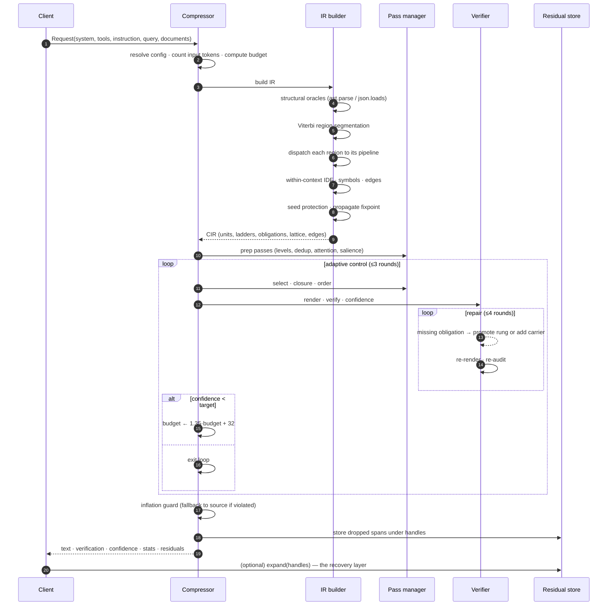
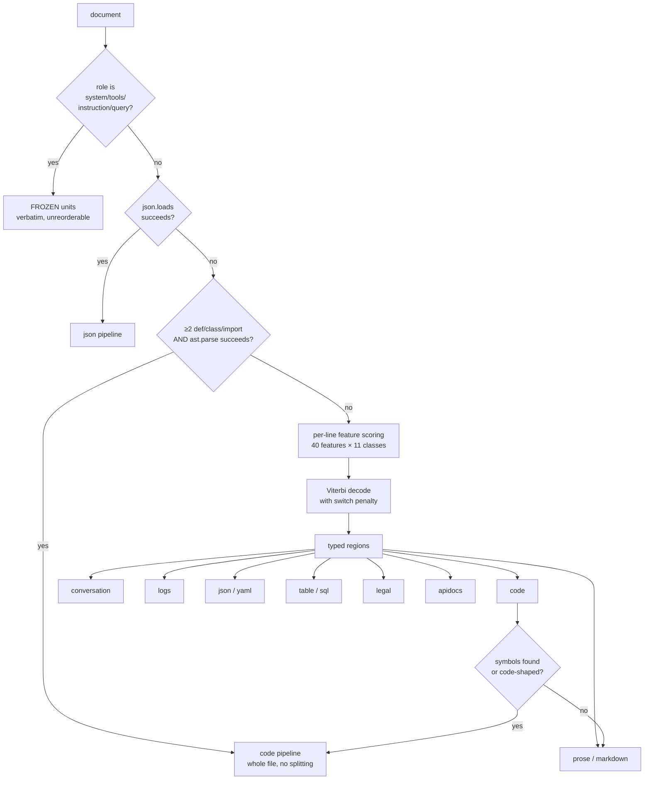
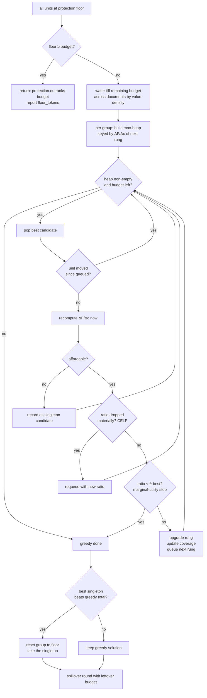
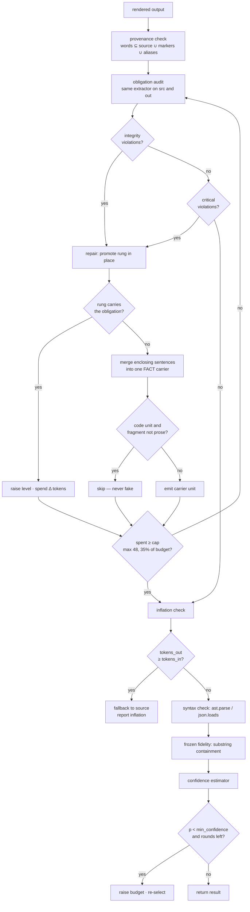
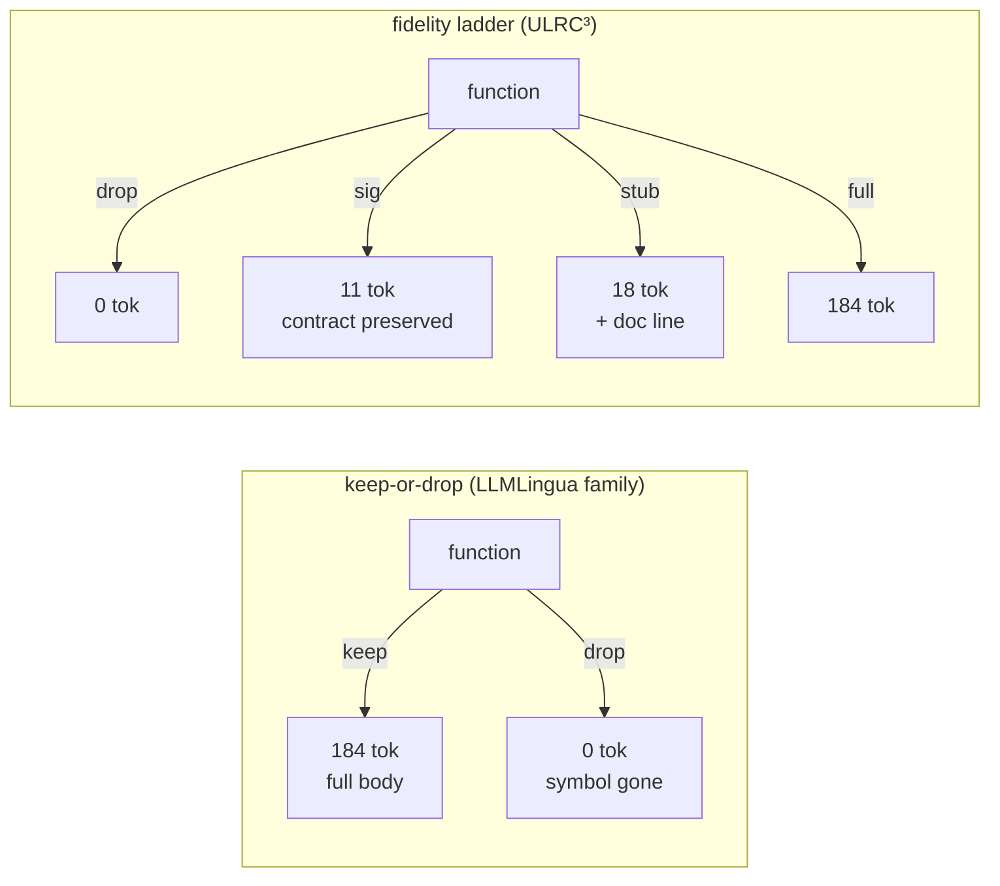

# Flowcharts

Control and data flow at four levels of zoom.

---

## 1. Request lifecycle

---

## 2. Front-end dispatch

The self-demotion at the bottom matters: a code front-end that finds no code has
misclaimed the region, and prose handling beats an opaque blob.

---

## 3. CASCADE selection

---

## 4. Verification and repair

---

## 5. The fidelity ladder as a decision space

At a 20-token budget the left graph must choose between blowing the budget by
9× and losing the symbol. The right graph buys the contract for 11.

Measured effect of collapsing the right graph into the left (`no_ladder`
ablation): **−4.6 points of compression** at equal quality across all suites,
and **51.8% → 0%** on a Python module, where every protected definition must
then be emitted in full.
